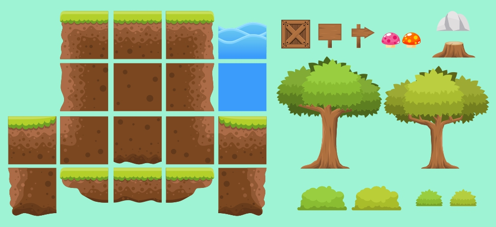

# Mini dokument wizji połączony z dokumentem technicznym

## Spis treści

- [Zamysł gry](#zamysł-gry)
- [Punktacja](#punktacja)
- [Otoczenie](#otoczenie)
  - Poziomy
    - [Poziom 1](Poziomy/Poziom1.md)
    - [Poziom 2](Poziomy/Poziom2.md)
    - [Poziom 3](Poziomy/Poziom3.md)
  - [Przeszkody](Przeszkody.md)
- Entity
  - [Gracz](Gracz.md)
  - [Przeciwnicy](Przeciwnicy.md)
  - [Znajdźki](Znajdźki.md)

## Zamysł gry

Bardzo prosty platformer 2D skupiający się głównie na podstawach pracy z Unity 6 i działania w małym zespole.

Graficznie prawdopodobnie skończy się na progremmer artach.

Całość składa się z 4 scen:

- Menu - Umożliwia wejście do okna wyboru poziomów, podejrzenie najlepszego wyniku oraz wyjście z gry
- [Poziom 1](Poziomy/Poziom1.md) - Wprowadza podstawowe mechaniki gry - poruszanie się, pokonywanie przeciwników
- [Poziom 2](Poziomy/Poziom2.md) - Rozwija koncepty wprowadzone w tutorialu
- [Poziom 3](Poziomy/Poziom3.md) - Ostateczny test umiejętności gracza

## Punktacja

Gracz jest nagradzany za 3 główne czynności:

- Czas przejścia poziomu
- Pokonanych przeciwników
- Zebrane znajdźki

Lepsze czasy oznaczają większą ilość punktów. Gracz nie ma limitu czasu na przejście poziomu. Jeśli zajmie mu to zbyt długo bonus za szybkie ukończenie poziomu wyniesie 0.

Znajdźki to monety/gwiazdki/coś co nagradza gracza za pokazanie swoich umiejętności platformingowych.

Najwyższy wynik jaki udało się zebrać po ukończeniu całej gry wyświetlany jest w menu.

## Otoczenie

TBA

### Otoczenie - Technicznie

Świat gry jest siatką, na której umieszczane są bloki z wykorzystaniem `Tilemap`y.

Przykładowy `Tileset`:

Opis zostanie rozwinięty wkrótce.
